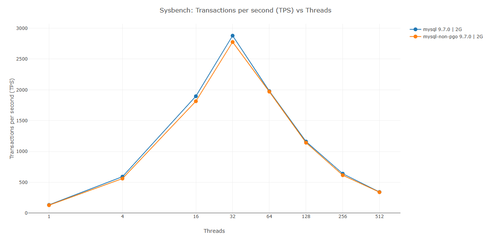
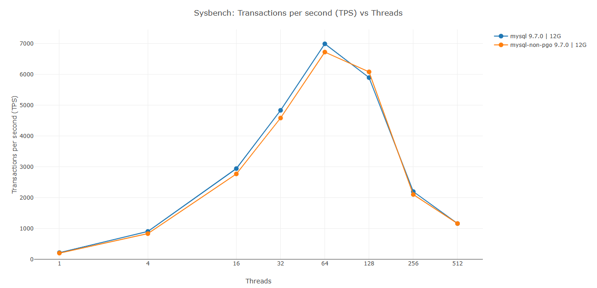
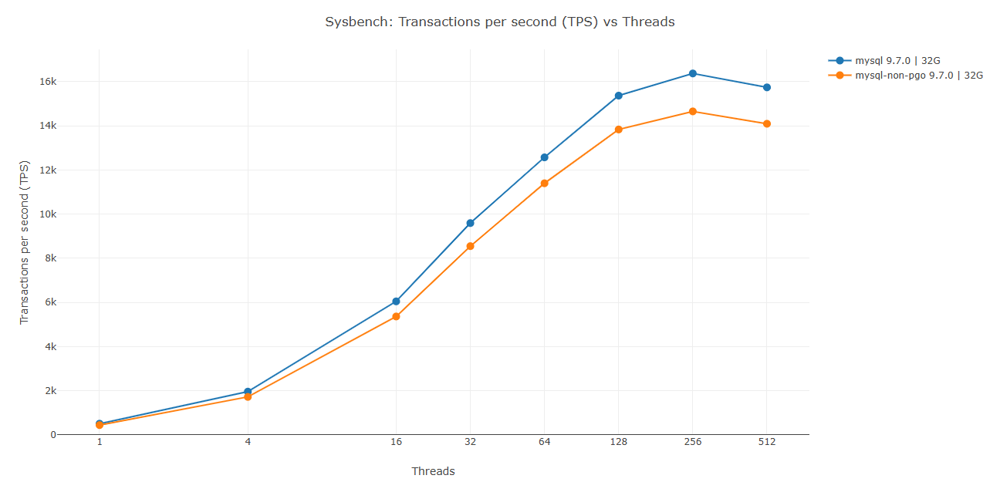

# MySQL 9.7.0 PGO Benchmark Analysis

This project contains performance benchmark results comparing Profile-Guided Optimization (PGO) and non-PGO builds of MySQL Server 9.7.0.

## Overview

**Servers Tested:**
- **MySQL 9.7.0** (PGO-enabled build released by Oracle)
- **MySQL 9.7.0 Non-PGO** (built without Profile-Guided Optimization — see [BUILD.md](BUILD.md))

**Tier Configurations:**
- Tier 2G: 2GB InnoDB buffer pool
- Tier 12G: 12GB InnoDB buffer pool
- Tier 32G: 32GB InnoDB buffer pool

## View Results

📊 **[Interactive Reports](https://percona-lab-results.github.io/2026-pgo/index.html)**

The benchmark reports are available as interactive HTML pages at:

[https://percona-lab-results.github.io/2026-pgo/index.html]((https://percona-lab-results.github.io/2026-pgo/index.html))


### Performance Graphs

**Tier 2G (2GB Buffer Pool):**



**Tier 12G (12GB Buffer Pool):**



**Tier 32G (32GB Buffer Pool):**



## Key Findings

### Performance Impact of PGO

MySQL 9.7.0 with Profile-Guided Optimization (PGO) demonstrates measurable performance improvements over the non-PGO build:

**Overall Performance Summary:**
- **Average improvement: 6.5%** across all configurations
- **Peak improvement: 14.3%** (Tier 32G, 1 thread), gradually tapering to 10.3% at 512 threads as concurrency increases
- Performance gains range from 0.5% to 14.3% in most scenarios
- Minor regression (-3.1% at Tier 12G, 128 threads)

**Performance by Buffer Pool Size:**
- **Tier 2G** (2GB buffer pool): Average improvement of **3.0%**
  - Best gains at 4 threads (5.5% improvement)
  - Gains range from 0.5% to 5.5% across all thread counts
  - Modest improvements with no regressions
- **Tier 12G** (12GB buffer pool): Average improvement of **4.1%**
  - Best gains at 4 threads (8.6% improvement)
  - Strong gains at low concurrency (1-4 threads: 7.3%-8.6%)
  - Minor regression at 128 threads (-3.1%), neutral at 512 threads (-0.0%)
- **Tier 32G** (32GB buffer pool): Average improvement of **12.2%**
  - Consistently strong gains across all thread counts (10.3% to 14.3%)
  - Peak performance at lowest concurrency (1 thread: 14.3%)
  - Maintains 11-12% improvement even at highest concurrency (128-512 threads)

**Key Observations:**
- PGO provides the most significant benefits with larger buffer pools (32GB tier shows 12.2% average improvement)
- Largest buffer pool configuration benefits from PGO across all concurrency levels with no regressions
- Low to moderate concurrency (1-32 threads) shows best PGO gains across all tiers
- Smaller buffer pools (2GB, 12GB) show more modest improvements and occasional regressions at very high thread counts
- The performance improvements demonstrate PGO's effectiveness in optimizing hot code paths, particularly when memory resources are abundant

### InnoDB Metrics Analysis

Deep analysis of InnoDB metrics reveals the source of PGO's performance improvements:

**Root Cause: CPU-Level Optimizations**
- PGO improvements are **NOT** from I/O optimization, caching, or lock reduction
- Buffer pool hit ratios remain virtually identical between PGO and non-PGO builds
- Lock contention is minimal in both builds
- All I/O metrics scale proportionally with increased throughput

**What PGO Actually Optimizes:**
- ✓ Better instruction cache utilization
- ✓ Improved branch prediction in hot code paths
- ✓ Optimized function inlining
- ✓ More efficient CPU instruction ordering

The metrics confirm that PGO's 6.5% average improvement comes entirely from making the CPU more efficient at executing MySQL's hot code paths, allowing it to process more transactions per second with the same hardware resources.

## What is PGO?

Profile-Guided Optimization (PGO) is a compiler optimization technique that uses runtime profiling data to guide code optimization. The compiler first instruments the code, collects execution profiles during typical workload runs, and then recompiles the code with optimizations targeted at the most frequently executed code paths.

**Benefits of PGO:**
- Improved branch prediction
- Better instruction cache utilization
- Optimized function inlining
- Reduced code bloat
- Better register allocation

## Benchmark Methodology

### Workload
- **Tool**: Sysbench OLTP Read/Write benchmark
- **Tables**: 20 tables
- **Table Size**: 5,000,000 rows per table
- **Thread Counts**: 1, 4, 16, 32, 64, 128, 256, 512

### Configuration
- **Warmup**: 
  - Read-only: 180 seconds
  - Read-write: 600 seconds
- **Measurement Duration**: 900 seconds (15 minutes) per thread count
- **Runs**: Single run per configuration

### System Metrics Collected
- InnoDB storage engine metrics
- MySQL status variables
- MySQL system variables
- System I/O statistics (iostat)
- Virtual memory statistics (vmstat)
- CPU statistics (mpstat)
- System statistics (dstat)

## Report Categories

### Performance Reports
- **Sysbench Individual Runs**: Detailed per-run performance metrics
- **Sysbench Average Results**: Aggregated performance across all runs
- **InnoDB Metrics**: Interactive storage engine metrics

### Variable Comparisons
- **Status Variables**: MySQL runtime status comparison across servers and tiers
- **System Variables**: MySQL configuration variables comparison

## Repository Structure

```
2026-pgo/
├── benchmark_logs/         # Raw benchmark data and logs
│   ├── mysql/              # MySQL 9.7.0 (PGO)
│   └── mysql-non-pgo/      # MySQL 9.7.0 (no PGO)
├── visuals/                # Report generation scripts and graphs
│   ├── vars_comparison_report.py
│   ├── innodb_metrics_report.py
│   ├── throughput_report.py
│   ├── generate_index.py
│   ├── pgo_all.png         # Performance graphs
│   ├── pgo_2G.png
│   ├── pgo_12G.png
│   └── pgo_32G.png
├── index.html              # Main report index
├── status_variables_comparison.html
├── system_variables_comparison.html
├── innodb_metrics_report.html
├── sysbench_ps_mysql_individual.html
├── sysbench_ps_mysql_average.html
├── run_metrics.sh          # Benchmark execution script
├── BUILD.md                # Build steps for MySQL non-PGO
└── README.md               # This file
```

## Building MySQL without PGO

For detailed build instructions, see **[BUILD.md](BUILD.md)**, which provides:
- Complete step-by-step build process from source download to Docker image
- CMake configuration details and compiler flags
- Docker image packaging strategy
- Build verification and testing steps
- Native AIO (libaio) configuration
- Comparison of PGO vs non-PGO builds

**Quick Summary:**

The MySQL 9.7.0 non-PGO build was created from source using:
- **Compiler**: GCC Toolset 14 on Oracle Linux 9
- **Build Type**: RelWithDebInfo (optimized with debug symbols)
- **Native AIO**: Enabled (libaio-devel)
- **SSL**: System OpenSSL
- **Output**: Docker image `mysql-non-pgo:9.7.0` (~2.9GB)

See BUILD.md for complete build commands and Docker configuration.

## Reproducing the Benchmark

### Prerequisites
- Docker installed and running
- MySQL client tools (mysql, sysbench)
- System metrics tools (iostat, vmstat, mpstat, dstat)
- Root access for CPU governor settings

### Running Benchmarks

```bash
cd ~/2026-pgo

# Run benchmark for MySQL 9.7.0 (PGO build)
./run_metrics.sh mysql 9.7.0 0

# Run benchmark for MySQL 9.7.0 non-PGO (custom build)
./run_metrics.sh mysql-non-pgo 9.7.0 0
```

### Generating Reports

```bash
cd visuals

# Generate all HTML reports
python3 vars_comparison_report.py
python3 innodb_metrics_report.py
python3 throughput_report.py
python3 generate_index.py
```

## Technical Details

### InnoDB Configuration
- **Buffer Pool Size**: 2GB / 12GB / 32GB (per tier)
- **Buffer Pool Instances**: Calculated as size/5GB (max 8)
- **Flush Method**: O_DIRECT
- **Flush Log at Commit**: 1 (full ACID)
- **Doublewrite**: Enabled
- **I/O Capacity**: 10,000 (max: 20,000)
- **I/O Threads**: 16 read, 16 write
- **Native AIO**: Enabled
- **Change Buffering**: None (disabled)
- **Redo Log Capacity**: 4GB (MySQL 8.4+ style)

### Binary Logging
- **Enabled**: Yes
- **Format**: ROW
- **Row Image**: MINIMAL
- **Sync Binlog**: 1 (synchronous)
- **Cache Size**: 4MB
- **Max Size**: 512MB

### General Settings
- **Max Connections**: 2000
- **Thread Cache**: 256
- **Performance Schema**: OFF
- **Character Set**: utf8mb4
- **Collation**: utf8mb4_unicode_ci

---

**Last Updated**: May 2026  
**MySQL Version**: 9.7.0  
**Build Platform**: Oracle Linux 9.7  
**Compiler**: GCC Toolset 14  
**Benchmark Tool**: Sysbench OLTP Read/Write
